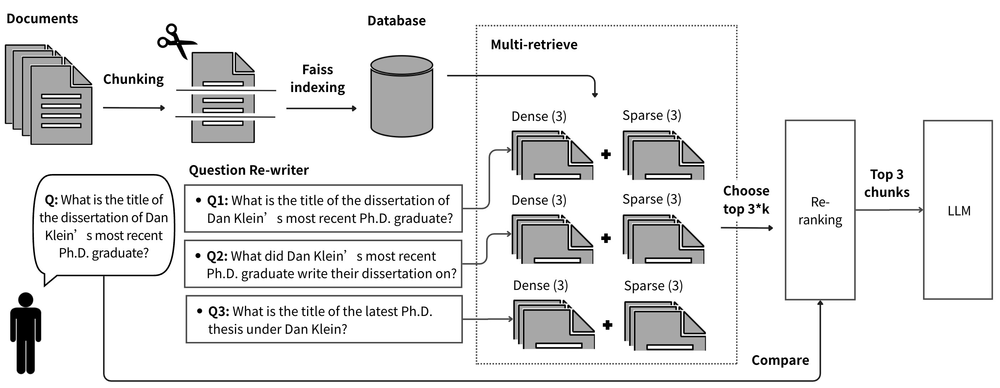
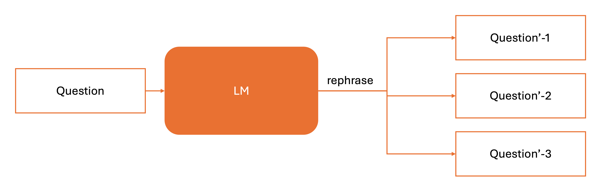
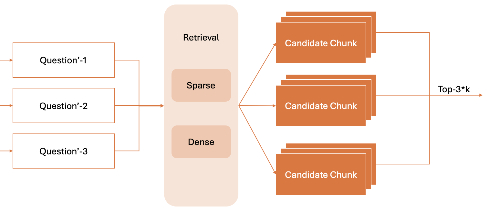
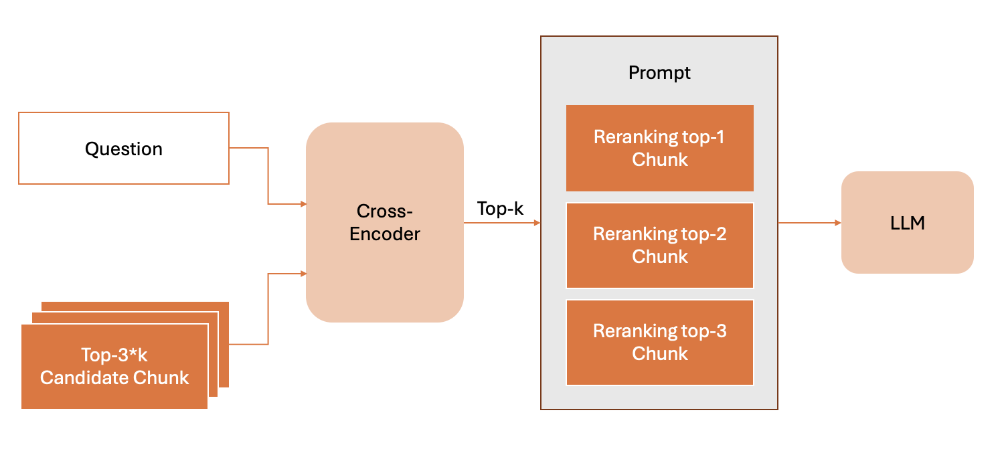
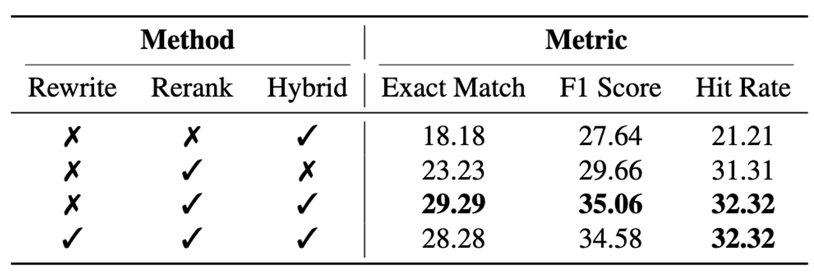

# RAG-UCBEE: A simple RAG system for the [UC Berkeley EE website](https://eecs.berkeley.edu/)

This is a simplified Retrieval-Augmented Generation (RAG) system designed to answer questions using the content from the UC Berkeley EECS website. It includes modular components for query rewriting, retrieval, and reranking, supporting ablation studies for performance evaluation.

## Framework



The system follows a three-stage pipeline:

1. **Query Rewrite**: Clarifies and disambiguates the user query.
2. **Retriever**: Uses a vector store to retrieve relevant documents.
3. **Reranker**: Ranks retrieved documents to improve final answer quality.

---

## Components

### Question Rewrite



- Implements `rewrite_query(query: str, history: List[str])` to transform user queries using context.
- Uses an LLM prompt to incorporate conversational history and generate clearer search queries.

### Retrieval



This system adopts a **hybrid retrieval strategy** that combines both sparse and dense retrieval methods:

- `score_dense(d)`: Computes a **dot product** between the query and document embeddings as the similarity score.
- `score_sparse(d)`: Uses **BM25(d, q)** to calculate a traditional keyword-based relevance score.

### Rerank



- Implements `rerank_results(question: str, documents: List[str])`.
- Uses an LLM-based scoring prompt to assign relevance scores and sort results accordingly.

### Ablation Study



- Run comparative experiments using combinations of:
  - With/without query rewriting
  - With/without reranking

The table shows the performance under different settings, evaluated using three key metrics:

| Metric       | Description |
|--------------|-------------|
| **Exact Match** | Percentage of answers that exactly match the gold standard. A strict metric. |
| **F1 Score**     | Measures the token-level overlap between the predicted and reference answers, balancing precision and recall. |
| **Hit Rate**     | Measures whether the correct answer appears in the retrieved documents (e.g., top-k). Reflects the effectiveness of retrieval. |


---

## Dataset

**Source**: [Berkeley EE website](https://eecs.berkeley.edu/)

Website content is crawled and chunked into smaller pieces for embedding and retrieval.

### Chunking Method

- Each page is first extracted as raw HTML and converted to plain text.
- The text is then split into chunks using a sliding window:
  - **Chunk size**: 500 characters
  - **Overlap**: 100 characters
- This ensures contextual continuity between chunks and improves retrieval quality.

Example:

```
[Chunk 1] "Welcome to EECS at Berkeley. We offer programs in..."
[Chunk 2] "...programs in CS and EE. Our graduate application..."
[Chunk 3] "...application deadlines are listed below..."
```

These chunks are then embedded using embedding model and indexed with FAISS.

---

## License

 Apache License 2.0. This project is for educational and research use only.
